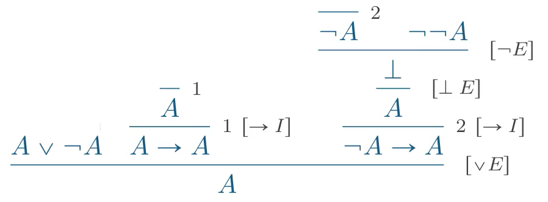
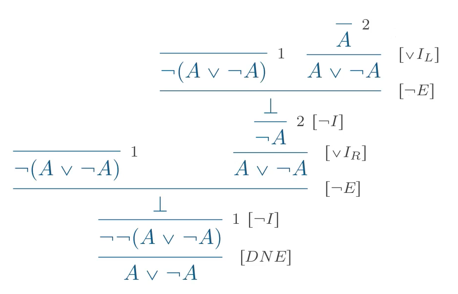
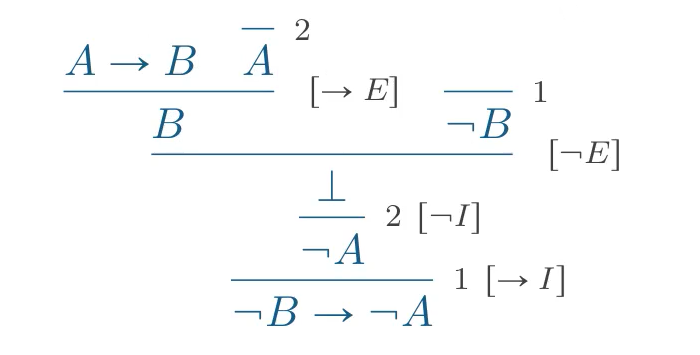
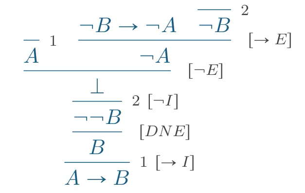

# Propositional Logic - Classical Reasoning/命题逻辑 - 经典逻辑

24/10/2021
<a style="text-decoration:none; color: black;" href="https://github.com/KevinZonda">KevinZonda</a>

## Basic Laws

### Law of Excluded Middle (LEM)

For each A we can always prove $A$ or $\neg A$

To make it simple $\vdash A \or \neg A$

$$
\cfrac{}{A \or \neg A}{[LEM]}
$$

### Double Negation Elimination (DNE)

$\neg \neg A \vdash A$

Equivalently, $(\neg A)\rightarrow \bot \vdash A$

$$
\cfrac{\neg\neg A}{A}{[DNE]}
$$

**proof by contradiction（构造性证明）** 

Classical reasoning allows using these 2 rules.

We should use them by **constructive(构造性)** or **intuitionistic(直觉)** logic.

### Some proof

#### LEM implies DNE

Assuming $A\or \neg A$, infer $\neg\neg A \vdash A$

<!--$$
\cfrac{A \or\neg A
          \qquad
          \cfrac
              {\cfrac{}{A}{1}}
              {A \rightarrow A}
              {\ 1\ [\rightarrow I]}
          \qquad
          \cfrac
              {
                  \cfrac
                  {
                      \cfrac
                      {
                          \cfrac
                          {}
                          {\neg A}
                          {\ 2}
                          \qquad
                          \neg\neg A
                      }
                      {\bot}
                      {[\neg E]}
                  }
                  {A}
                  {\ 2 \ [\bot E]}
              }
              {\neg A\rightarrow A}
              {\ 2 \ [\rightarrow I]}
      }
      {A}
      {[\or E]}
$$-->

#### DNE implies LME

Assuming $\neg\neg A \vdash A$, infer $\vdash A\or \neg A$

<!--$$
\cfrac
{
    \cfrac
    {
        \cfrac
        {
            \cfrac {}
            {
                \neg (A \or \neg A)
            }{1}
            \qquad
            \cfrac
            {
                \cfrac
                {
                    \cfrac
                    {
                        \cfrac
                        {}
                        {\neg(A \or \neg A)}
                        {1}
                        \qquad
                        \cfrac
                        {
                            \cfrac {}
                            {A}{2}
                        }
                        {A \or \neg A}
                        {[\or I_L]}
                    }
                    {\bot}
                    {[\neg E]}
                }
                {\neg A}
                {\ 2\ [\neg I]}
            }
            {A \or \neg A}
            {\ [\or I]}
        }
        {\bot}
        {[\neg E]}
    }
    {\neg\neg(A \or \neg A)}
    {\ 1\ [\neg I]}
}
{A\or \neg A}
{[DNE]}
$$-->

### Contrapositive/换质位推理

Given an implication $A \rightarrow B$, the formula $\neg B \rightarrow\neg A$ is called the **contrapositive**.

**Proof:** $A\rightarrow B \vdash \neg B \rightarrow \neg A$

**Proof:** $\neg B \rightarrow \neg A \vdash A\rightarrow B$

### In Sequent Calculus

$$
\cfrac{}
{\Gamma\vdash A \or\neg A}{[LEM]}
$$

$$
\cfrac
{\Gamma\vdash\neg\neg A}
{\Gamma \vdash A}
{[DNE]}
$$

## Classical vs Intuitionistic 

| **Intuitionistic**                                           | **Classic**                                                  |
| ------------------------------------------------------------ | ------------------------------------------------------------ |
|                                                              |                                                              |
| $\cfrac{\Gamma\vdash A\qquad\Gamma, B\vdash C}{\Gamma, A \rightarrow B \vdash C}[\rightarrow E]$ | $\cfrac{\Gamma\vdash A, \Delta\qquad\Gamma, B\vdash \Delta'}{\Gamma, A \rightarrow B \vdash \Delta, \Delta'}[\rightarrow L]$ |
|                                                              |                                                              |
| $\cfrac{\Gamma, A \vdash B}{\Gamma\vdash A \rightarrow B}{[\rightarrow R]}$ | $\cfrac{\Gamma, A \vdash B, \Delta}{\Gamma\vdash A \rightarrow B, \Delta}{[\rightarrow R]}$ |
|                                                              |                                                              |
|                                                              |                                                              |
| $\cfrac{\Gamma\vdash B \qquad \Gamma, B\vdash A}{\Gamma\vdash A}{[Cut]}$ | $\cfrac{\Gamma_1\vdash B,\Delta_1 \qquad \Gamma_2, B\vdash \Delta_2}{\Gamma_1, \Gamma_2\vdash \Delta_1, \Delta_2}{[Cut]}$ |
|                                                              |                                                              |
| $\cfrac{\Gamma\vdash A \qquad \Gamma\vdash B}{\Gamma\vdash A\and B}{[\and R]}$ | $\cfrac{\Gamma_1\vdash A,\Delta_1 \qquad \Gamma_2\vdash B, \Delta_2}{\Gamma_1, \Gamma_2\vdash A\and B, \Delta_1, \Delta_2}{[\and R]}$ |
|                                                              |                                                              |
|                                                              |                                                              |
| $\cfrac{\Gamma, A\vdash C \qquad \Gamma, B\vdash C}{\Gamma, A \or B \vdash C}{[\or L]}$ | $\cfrac{\Gamma_1, A\vdash \Delta_1 \qquad \Gamma_2, B\vdash \Delta_2}{\Gamma_1, \Gamma_2, A \or B \vdash \Delta_1, \Delta_2}{[\or L]}$ |
|                                                              |                                                              |
|                                                              |                                                              |
| $\cfrac{\Gamma\vdash A}{\Gamma, \neg A \vdash B}{[\neg L]}$  | $\cfrac{\Gamma\vdash A, \Delta}{\Gamma, \neg A \vdash \Delta}{[\neg L]}$ |
|                                                              |                                                              |
| $\cfrac{\Gamma, A\vdash \bot}{\Gamma\vdash \neg A}{[\neg R]}$ | $\cfrac{\Gamma, A\vdash \Delta}{\Gamma\vdash \neg A, \Delta}{[\neg R]}$ |
|                                                              |                                                              |
|                                                              |                                                              |
| $\cfrac{\Gamma\vdash A}{\Gamma\vdash A \or B}{[\or R_L]}$    |                                                              |
|                                                              | $\cfrac{\Gamma\vdash A, B, \Delta}{\Gamma\vdash A \or B}{[\or R]}$ |
| $\cfrac{\Gamma\vdash A}{\Gamma\vdash B \or A}{[\or R_2]}$    |                                                              |
|                                                              |                                                              |

### Other Structural Formulas

#### Right Exchange

$$
\cfrac{\Gamma\vdash\Delta_1, B, A, \Delta_2}{\Gamma\vdash\Delta_1, A, B, \Delta_2}{[X_R]}
$$

#### Right Weakening

$$
\cfrac{\Gamma\vdash\Delta}{\Gamma\vdash A, \Delta}{[W_R]}
$$

#### Right Contraction

$$
\cfrac{\Gamma\vdash A, A, \Delta}{\Gamma\vdash A, \Delta}{[C_R]}
$$

## Rules of the Classical Sequent Calculus

