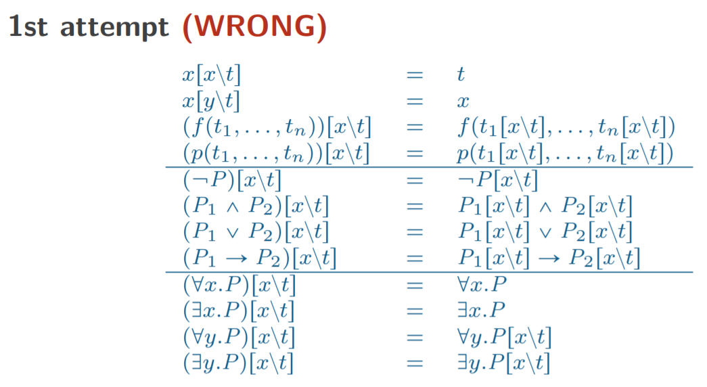
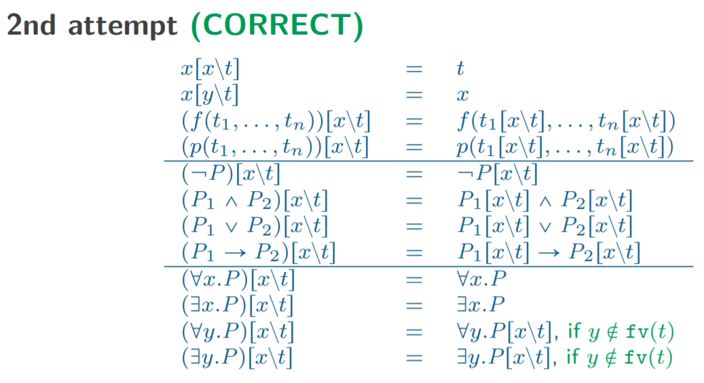

# Predicate Logic - Natural Deduction Proofs/谓词逻辑 - 自然演绎

## Free & Bound Variables/自由变量 & 指导变元

### Bound Variables/指导变元

对于谓词逻辑中，量词（$\forall, \exists$）后的变量为指导变元。例如：

$$
\forall x. P(x)
$$

此处 $x$ is bound by quantifier $\forall$。

修改 bound variable的名字并不会改变其含义。

### Free Variables/自由变量

如果变量不是指导出现，则为自由变量。

例如：

$$
\forall y. x \leq y
$$

此处 $x$ 为 自由变量，$y$为指导变元。

修改 自由变量会修改其含义。

The *scope (辖域)* of a quantified formula of the form $\forall x.P$ or $\exists x.P$ is $P.$  
The quantifier are said to **bind** $x$.

| Free Variables | Bound Variables |
| --- | --- |
| $\text{fv}(x) = \left\{ x \right\}$                                | |
| $\text{fv}(f(t_1, \cdots, t_n)) = \text{fv}(t_1) \cup \cdots \cup \text{fv}(t_n)$ | |
| $\text{fv}(p(t_1, \cdots, t_n)) = \text{fv}(t_1) \cup \cdots \cup \text{fv}(t_n)$ | $\text{bv}(p(t_1, \cdots, t_n))  = \emptyset$ |

| Free Variables | Bound Variables |
| --- | --- |
| $\text{fv}(\neg P) = \text{fv}(P)$                                | $\text{bv}(\neg P) = \text{bv}(P)$                         |
| $\text{fv}(P_1 \wedge P_2) = \text{fv}(P_1) \cup \text{fv}(P_2)$  | $\text{bv}(P_1 \wedge P_2) = \text{bv}(P_1) \cup \text{bv}(P_2)$  |
| $\text{fv}(P_1 \vee P_2)   = \text{fv}(P_1) \cup \text{fv}(P_2)$  | $\text{bv}(P_1 \vee P_2)   = \text{bv}(P_1) \cup \text{bv}(P_2)$  |
| $\text{fv}(P_1 \to P_2)    = \text{fv}(P_1) \cup \text{fv}(P_2)$  | $\text{bv}(P_1 \to P_2)    = \text{bv}(P_1) \cup \text{bv}(P_2)$  |

| Free Variables | Bound Variables |
| --- | --- |
| $\text{fv}(\forall x.P) = \text{fv}(P) \backslash \left\{ x \right\}$  | $\text{bv}(\forall x.P) = \text{bv}(P) \cup \left\{ x \right\}$  |
| $\text{fv}(\exists x.P) = \text{fv}(P) \backslash \left\{ x \right\}$  | $\text{bv}(\exists x.P) = \text{bv}(P) \cup \left\{ x \right\}$  |

## Substitute/代入

需要注意的是，在带入时自由变量不应该被绑定。注意上图的最后一个例子。

$$
\forall y.x \leq y[x\backslash t]\\
\text{Substitute } t = y\\
\forall y.y \leq y
$$

使用附加条件后，自由变量不会被 captured。

## Rules

### $\forall$

#### Elimination

$$
\cfrac{
    \forall x.P
} {
    P[x\backslash t]
} [\forall E]
$$

**Condition:** $\text{fv}$(t) 必须不能和任何 $P$ 的指导变元冲突。

**白话文：** 在自上而下的推导时，需要将 $t$ 代入 $x$，但是这个 $t$ 必须是自由变量并且不能和 $P$ 中已有的变量冲突。

#### Introduction

$$
\cfrac {
    P[x\backslash y]
} {
    \forall x.P
}[\forall I]
$$

**Condition:** $y$ 必须不能是在还未 discharged 的假说或在 $\forall x.P$ 中的自由变量。

**白话文：** 在自上而下的推导时，需要将 $y$ 提取为 $x$。需要注意的是替换 $y$ 的值 $x$ 是不可以是在 $P$ 存在的自由变量，且也不能在还没有被 discharged 的假说中存在。

### $\exists$

#### Introduction

$$
\cfrac {
    P[x\backslash t]
} {
    \exists x.P
}[\exists I]
$$

**Condition:** $\text{fv}(t)$ 必须不能与 $\text{bv}(P)$ 冲突。

**白话文：** 在自上而下的推导时，需要将 $t$ 提取为 $x$。需要注意的是对于上层 $P$ 中的自由变量 $t$，不能和下层 $P$ 的约束变量冲突。

#### Elimination

$$
\cfrac{
    \begin{matrix}
        \\
        \\
        \\
        \exists x.P\\
    \end{matrix}
    
    \qquad
    \begin{matrix}
        \cfrac{}{P[x\backslash y]}\ 1\\
        \vdots\\
        Q\\
    \end{matrix}
} {
    Q
} [\exists E]
$$

**Condition:** $y$ 必须在 $Q$ 中或者还没有被 discharged 的假说或 $\exists x.P$ 中自由。

**白话文：** 这个过程类似于 $[\to E]$，如果将左侧看为命题 $P$，右侧则可以看为 $P \to Q$，$P\wedge P \to Q \Rightarrow Q$。但是需要注意的代入 $P$ 的 $y$ 必须在未被 discharged 的假说， $Q$ 或者 $\exists x.P$ 中自由（不以指导变元出现）。

### Examples

$$
\cfrac {
    \cfrac {
        \cfrac {
            \cfrac {
                \cfrac{

                } {
                    \forall z.p(z)
                }\ 1
            } {
                p(y)
            } [\forall E]
        } {
            p(y) \vee q(y)
        } [\vee I_L]
    } {
        \forall x.p(x) \vee q(x)
    } [\forall I]
} {
    (\forall z.p(z)) \to \forall x. p(x) \vee q(x)
}\ 1 \ [\to I]
$$

**Conditions:**
- $y$ does not occur free in not-yet-discharged hypotheses or in
$\forall x.p(x) \vee q(x)$
- $y$ does not clash with bound variables in $p(z)$

