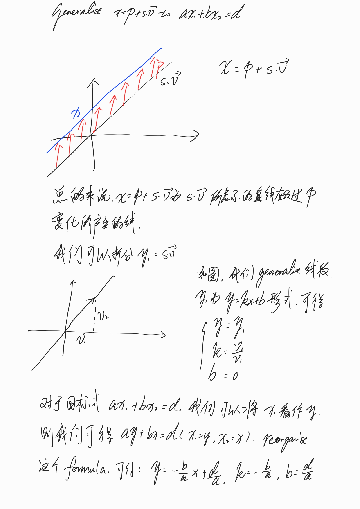
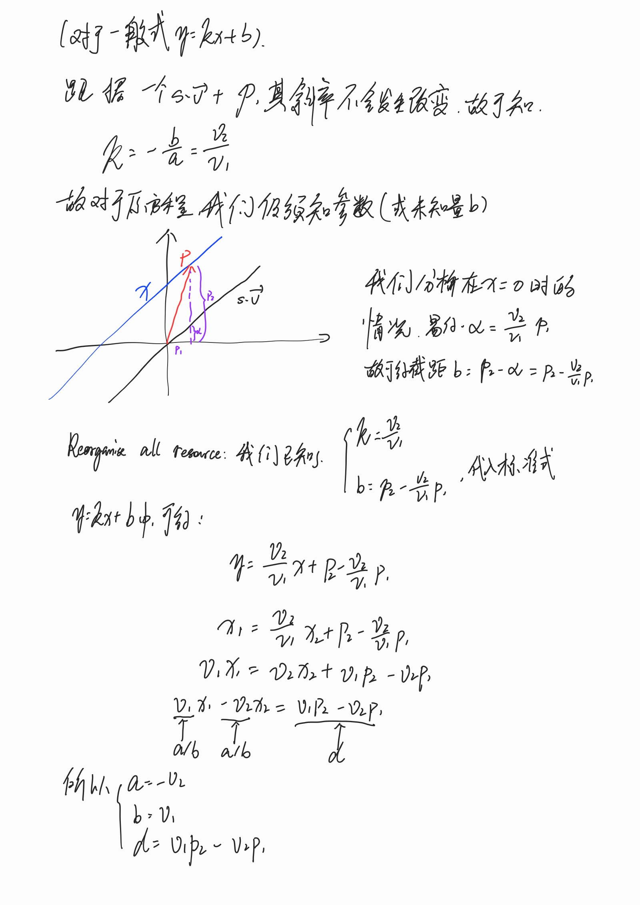

# Inner Product

## Equations in Analytic Geometry

**Example:**

$$
x_1 - 2x_2 = 3 \longrightarrow
\begin{matrix}
    x_1=3+2x_2\\
    x_2: \text{ freel chosen}\\
\end{matrix}
$$

$$
x=\left(
    \begin{matrix}
        x_1\\
        x_2
    \end{matrix}
\right)=
\left(
    \begin{matrix}
        3+2x_2\\
        x_2
    \end{matrix}
\right)=
\left(
    \begin{matrix}
        3\\
        0
    \end{matrix}
\right)+
x_2 \cdot
\left(
    \begin{matrix}
        2\\
        1
    \end{matrix}
\right)
$$

其是参数形式（parametric representation）表示一根线。

我们可以将
$x_2 \cdot
\left(
    \begin{matrix}
        2\\
        1
    \end{matrix}
\right)$ 看成一个 $y=0.5x$ 的直线，因为其为向量
$
\left(
    \begin{matrix}
        2\\
        1
    \end{matrix}
\right)
$
的乘积。

**Example:**

$$
x_1 -2x_2+3x_3=5\longrightarrow 

\begin{matrix}
    x_1=5+2x_2-3x_3\\
    x_2, x_3: \text{ freely chosen}\\
\end{matrix}
$$

$$
x=\left(
    \begin{matrix}
        x_1\\
        x_2\\
        x_3
    \end{matrix}
\right)=
\left(
    \begin{matrix}
        5+2x_2-3x_3\\
        x_2\\
        x_3
    \end{matrix}
\right)=
\left(
    \begin{matrix}
        5\\
        0\\
        0
    \end{matrix}
\right)+
x_2 \cdot
\left(
    \begin{matrix}
        2\\
        1\\
        0
    \end{matrix}
\right)+
x_3 \cdot
\left(
    \begin{matrix}
        -3\\
        0\\
        1
    \end{matrix}
\right)
$$

所以这是一个平面（plane）。

总结来说，为了以参数形式表示，我们通常将 $x_n (n \neq 1)$ 放在 $RHS$，将 $x_1$ 放在 $LHS$ 从而形成 $x_1=\cdots$ 的形式。在后式中的 $x_n$ 均为自由选取。

```
           +--------------+
s -------> | Param. Repr. | ---> Point x on the line
           +--------------+

           +--------------+
Point ---> | Linear Equ.  | ---> Yes/No
           +--------------+

           +--------------+                 +--------------+
s -------> | Param. Repr. | ---> Point ---> | Linear Equ.  | ---> Yes/No
           +--------------+                 +--------------+
```

### Translating between Parametric Representation & Normal Form

$$
Equation \Longleftrightarrow Parametric\ Representation
$$

#### 线

$$
x=P+s\cdot \vec{v}=
\left(
    \begin{matrix}
        P_1\\
        P_2\\
    \end{matrix}
\right)+
s\cdot
\left(
    \begin{matrix}
        v_1\\
        v_2\\
    \end{matrix}
\right)\\
\text{Want } ax_1+bx_2=d
$$

**Ans:**

$$
\begin{matrix}
a=-v_2\\
b=v_1\\
d=-v_2p_1+v_1p_2
\end{matrix}
$$

**证明：**




#### 平面

同样，此方法可以拓展至平面：

$$
x=P+s\cdot \vec{v}+t\cdot \vec{w}=
\left(
    \begin{matrix}
        P_1\\
        P_2\\
        P_3
    \end{matrix}
\right)+
s\cdot
\left(
    \begin{matrix}
        v_1\\
        v_2\\
        v_3
    \end{matrix}
\right)+
t\cdot
\left(
    \begin{matrix}
        w_1\\
        w_2\\
        w_3
    \end{matrix}
\right)\\
\text{Want } ax_1+bx_2+cx_3=d
$$

**Ans:**
$$
\begin{matrix}
a=v_2w_3-v_3w_2=
    \left|
        \begin{matrix}
            v_2 & w_2\\
            v_3 & w_3\\
        \end{matrix}
    \right|\\
b=v_3w_1-v_1w_3=
    \left|
        \begin{matrix}
            v_3 & w_3\\
            v_1 & w_1\\
        \end{matrix}
    \right|\\
c=v_1w_2-v_2w_1=
    \left|
        \begin{matrix}
            v_1 & w_1\\
            v_2 & w_2\\
        \end{matrix}
    \right|\\
d=ap_1+bp_2+cp_3
\end{matrix}
$$