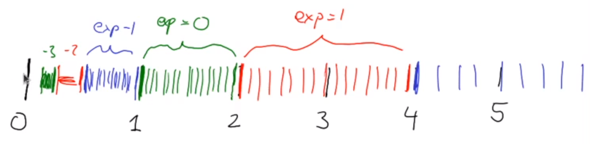

# 计算机数学基础：实数与浮点数

<center>
<span>09/10/2021</span>
<a style="text-decoration:none; color: black;" href="https://github.com/KevinZonda">KevinZonda</a>
</center>

## Scientific Notation/科学计数法

$$
\N \subset \Z \subset \mathbb{Q} \subset \R\\
\text{自然数} \subset \text{整数} \subset \text{有理数} \subset \text{实数}
$$

当进制 ≥ 2 时，实数可表示为：

$$
d_nd_{n-1}\cdots d_1d_0\ .\ d_{-1} d_{-2} \cdots
$$

其值为  

$$
d_n\times b^n + d_{n-1} \times b^{n-1} + \cdots + d_1 \times b^1 + d_0 \times b^0 + d_{-1} \times b^{-1} + \cdots + d_{-n} \times b^{-n}
$$

```
123.145 = 1.23145 × 10^2
        = 1.23145E2
          1.23145 mantissa
          E2      exponent
```

## Floating Point Numbers/浮点数

$b = 2$, mantissa of 24 digits, exponent of 8 digits, sign of 1 digit.

**Attention:** mantissa cannot start with 0, if it is 0, the number is not normalised.

Therefore, in binary, the mantissa can only be 1, so we can ignore it. So we just need 23 bits to store mantissa.

We only need to store:

$$
d_0\ .\ d_{-1} d_{-2} \cdots d_{-23}
$$

$d_0$ must be 1, so no need be stored.

### Register

```
[31][23-30][0-22]
 S     E     M
```

| Bit No | Size    | Field Name   |
| ------ | ------- | ------------ |
| 31     | 1 bit   | Sign (S)     |
| 23-30  | 8 bits  | Exponent (E) |
| 0-22   | 23 bits | Mantissa (M) |

### Examples/样例

${(1/5)}_{10} = (0.001100110011...)_{2} = (1.1001100E-3)_{2}$


## Another View/换个角度

### Range/范围

In a fixed exponent `n`, we have:

- Min: $1.000 ... 00 E n$
- Max: $1.111 ... 11 E n$

So we have $2^{33}$ floats number with a fixed exponent.

对于当 $n = 0$，浮点数范围其实为 $[1, 2)$

$n = -1, [0.5, 1)$

范围为 $[2^n, 2^{n+1})$



### Numeral System/记数系统

| 数集 | 样例                 | 运算       | 代数系统 |
| ---- | -------------------- | ---------- | -------- |
| $\N$    | 0, 1, 2, ...         | +, ×       |          |
| $Z$    | -2, -1, 0, 1, 2, ... | +, ×, -    | Ring     |
| $\mathbb{Q}$    | a/b                  | +, ×, -, ÷ | Field    |
| $\R$    | 3.14159...           | +, ×, -, ÷ | Field    |

- Computer integers behave like $\Z_{2^{32}}$ is not a field.
- There are other field, $\Z_m$, $m$ is prime.
- Floating point numbers do not form a field.

## Reference

- "Floating Point Numbers": <https://www.doc.ic.ac.uk/~eedwards/compsys/float/>