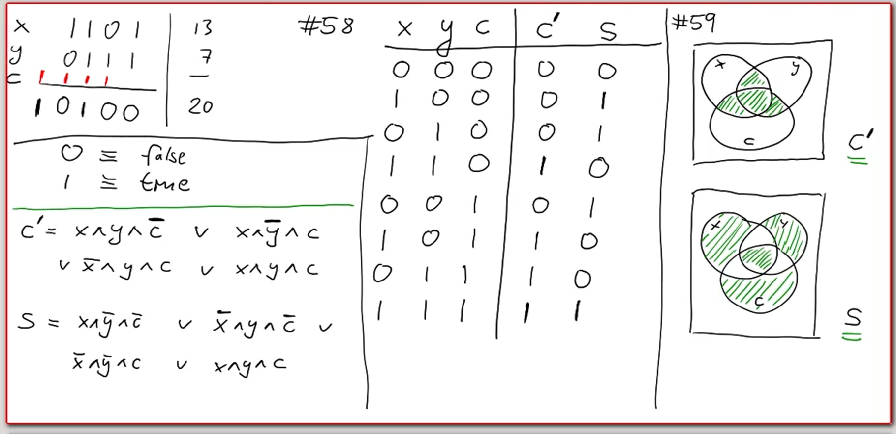

# 布尔代数基础：集合与布尔代数

<center>
<span>20/10/2021</span>
<a style="text-decoration:none; color: black;" href="https://github.com/KevinZonda">KevinZonda</a>
</center>

## Basic

### Subset/子集

```
{1, 2, 4, 2048} ⊆ N
                ^ is a subset/part of
```

$$
\left\{\right\} \subseteq A\ \empty
$$

{} and ∅ are both empty set.

$$
B = \left\{x \in A \mid x \text{ satisfies } c\right\}\\

B \subseteq A \text{ iff } \forall x. x \in B \Rightarrow x \in A\\

A = B \text{ iff } \forall x. x \in B \Leftrightarrow x \in A\\
\qquad\text{ iff } A \subseteq B \wedge B \subseteq A
$$

### Intersection/交集


$$
B_1, B_2 \subseteq A\\
B_1 \cap B_2 = \left\{ x \in A \mid x \in B_1 \wedge x \in B_2 \right\}\\
B \cap \empty = \empty\\
B \cap A = B \\
B_1 \cap B_2 = B_2 \cap B_1\\
B_1 \cap (B_2 \cap B_3)=(B_1 \cap B_2) \cap B_3
$$

### Complement/补集

$$
B \subseteq A\\
\overline{B} = \left\{ x \in A \mid x \notin B\right\}
$$

### Set Difference

$$
B_1, B_2 \subseteq A\\
B_1 \backslash B_2  = \left\{ x \in A \mid x \in B_1 \wedge x \notin B_2 \right\} \\
B \backslash \empty = B \\
B \backslash A = \empty \\
B_1 \backslash B_2 = B_1 \backslash (B_2 \cap B_2)
$$

## Powerset/幂集

原集合中所有的子集（包括全集和空集）构成的集族

$$
\mathcal{P}\left\{a, b, c\right\} = \left\{∅, \left\{a\right\}, \left\{b\right\}, \left\{c\right\}, \left\{a, b\right\}, \left\{a, c\right\}, \left\{b, c\right\}, \left\{a, b, c\right\}\right\}
$$

**Theorem:** The carinality of PA is strictly larger than the card. of A.

$$
|N| < |R| < |PR|
$$

## Propositional logic and Boolean algebras

### Distributivity Laws

$$
A \cap (B \cup C) = (A \cap B) \cup (A \cap C)\\  
A \cup (B \cap C) = (A \cup B) \cap (A \cup C)
$$

### de Morgan law


$$
\overline{A \cup B} = \overline{A} \cap \overline{B}\\
\overline{A \cap B} = \overline{A} \cup \overline{B}\\
$$

### Symbols

| Set | Boolean Algebra |
| :-: | :-------------: |
|  ∪  |       ∨         |
|  ∩  |       ∧         |
|  _  |       ¬         |
|  ∅  | false, ff, ⊥    |
|  X  | true, tt, T     |

**Boolean Algebra:** A set of elements. Operations: ∨, ∧, ¬; Constants: T, ⊥. Satisfies the laws above.

false ∨ true = true (by Annihilation)

| ∨ | F | T |
| - | - | - |
| F | F | T |
| T | T | T |

| ∧ | F | T |
| - | - | - |
| F | F | F |
| T | F | T |

¬ False = ¬ false ∨ true (neutral element)
= true (complement)

| ¬ | F | T |
| - | - | - |
|   | T | F |

### Maths in CPU

C means carry (进位).


