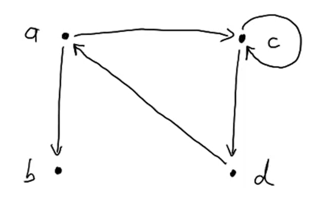
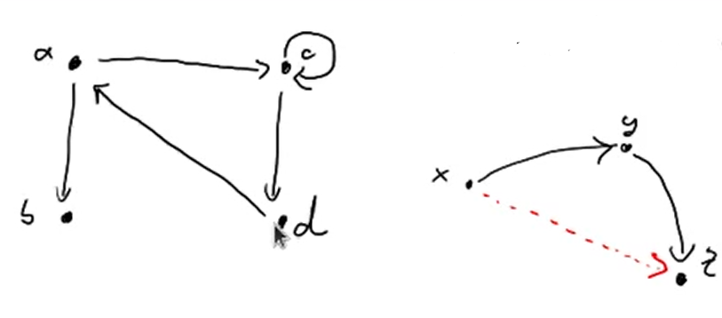
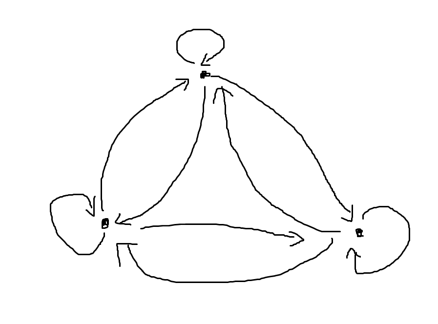

# 集合论基础：二元关系

<center>
<span>14/11/2021</span>
<a style="text-decoration:none; color: black;" href="https://github.com/KevinZonda">KevinZonda</a>
</center>

## Basic/基础

$$
R\subseteq A_1 \times A_2 \times ... \times A_n
$$

被称之为 $n$ 元关系（$n$-ary relation）。

## Binary Relationship/二元关系

### Definitions/定义

如果一个集合满足以下条件之一：
- 集合非空且其元素都为有序对
- 集合是空集

则称该集合为一个二元关系，记作 R。对于二元关系 R，如果 $(x, y)\in R$，则记作 $xRy$。

设 $A, B$ 为集合，$A \times B$ 的任何子集所定义的二元关系称作**从 $A$ 到 $B$ 的二元关系（from $A$ to $B$）**，特别当 $A=B$ 时，称为 **$A$ 上（on $A$）** 的二元关系。

定义**空关系** 对于任何集合 $A$，空集 $\emptyset$ 是 $A \times A$ 的子集，称作 $A$ 上的**空关系**。

定义**全域关系** $E_A=\left\{(x, y) \mid x \in A \wedge y \in A \right\}=A\times A$

定义**恒等关系** $I_A=\left\{ (x, x) \mid x \in A \right\}$

定义**定义域（domain）** $R$ 中的第一个元素组成的集合称之为 $R$ 的**定义域（domain）**，记作$\text{dom}R$。

定义**值域（co-domain, range）** $R$ 中的第一个元素组成的集合称之为 $R$ 的**值域（co-domain, range）**，记作$\text{ran}R$。

定义**域（field）** $R$ 的定义域和值域的并集称作 $R$ 的**域（field）**，记作 $\text{fld}R$，形式化为：
$$
\text{fld}R = \text{dom}R \cup \text{ran}R
$$

**Example:**

$$
A=\left\{a, b, c, d\right\}\\
R\subseteq A \times A=A^2\\
R=\left\{(a, c), (a, b), (c, d), (c, c), (d, a)\right\}
$$




一个二元关系同样被称为**图（graph）**。

$E \in A$ 是**顶点（vertices/vertex）**

$E \in R$ 是**边（edges）**

设 $R$ 为二元关系，$R$ 的**逆关系**，简称为 $R$ 的逆，记作 $R^{-1}$。

$$
R^{-1} = \left\{(x, y) \mid xRy\right\}
$$

$R$ 在 $A$ 上的**限制**记作 $R \upharpoonright A$，其中
$$
R \upharpoonright A = \left\{(x, y) \mid xRy\wedge x\in A\right\}
$$

$A$ 在 $R$ 下的 **像（image）** 记作 $R[A]$，其中：
$$
R[A] = \text{ran}(R \upharpoonright A)
$$

用正常人的语言描述：像就是集合 $A$ 在关系 $R$ 后的结果的集合。如果使用程序语言描述，可以描述为

```csharp
public static Set<T> GetImage(Set<T> A, Func<T> relation)
{
    var image = new Set<T>();
    
    foreach (var element in A)
    {
        if (A.Contains(element))
        {
            image.Add(relation.Invoke(element));
        }
    }
    return image;
}
```

## Features/性质

### Closure/闭包


如果 $R$ 是集合 $A$ 上关系，则 $R$ 的闭包是 $A$ 上的关系 $R'$，使得 $R'$ 满足以下条件：
1. $R'$ 是自反（对称或传递）的
2. $R \subseteq R'$
3. 对 $A$ 上任何包含 $R$ 的自反（对称或传递）关系 $R''$ 有 $R' \subseteq R''$


### Reflexivity/自反性性

$$
R\subseteq A \times A\text{ is reflexive } \stackrel{\text{def}}{\Longleftrightarrow} \forall x \in A. (x, x)\in R
$$

$$
\forall x (x \in A \to (x, x) \in R), \text{ 则称 } R \text{ 在 } A \text{ 上是自反的 }
$$

#### Reflexive closure/自反闭包

$$
\text{refl-closure}(R)\stackrel{\text{def}}{=} R \cup \left\{ (x, y) \in A^2 | x = y\right\}
$$

$$
r(R)=R\cup R^0 =R\cup I_A
$$

#### Irreflexive/反自反性

$$
R\subseteq A^2 \text{ is irreflexive }\stackrel{\text{def}}{\Longleftrightarrow} \forall x\in A. (x, x) \in R \ (\neg ((x, x)\in R)
$$

$$
\forall x (x \in A \to (x, x) \notin R), \text{ 则称 } R \text{ 在 } A \text{ 上是反自反的 }
$$


### Symmetry/对称性

$$
R\subseteq A \times A\text{ is symmatric } \stackrel{\text{def}}{\Longleftrightarrow} \forall (x, y) \in A^2. (x, y)\in R \Rightarrow (y, x)\in R\\
$$

$$
\forall x\ \forall y (x, y \in A) \wedge (x, y) \in R \to (y, x) \in R, \text{ 则称 } R \text{ 在 } A \text{ 上是对称的 } 
$$

#### Symmetry-closure/对称闭包

$$
\text{symm-closure}(R)\stackrel{\text{def}}{=}R\cup R^{-1}
$$

$$
s(R)=R\cup R^{-1}
$$

**Example:**
$$
R=\left\{(a, b), (a, c), (c, d), (d, a), (c, c)\right\}\\
\text{symm-closure}(R)=\left\{(a, b), (b, a), (a, c), (c, a), (c, d), (d, c), (d, a), (a, d), (c, c)\right\}
$$

### Anti-Symmetric/反对称性

$$
R\subseteq A^2 \text{ anti-symmetric }\stackrel{\text{def}}{\Longleftrightarrow} \forall x, y \in A. x\ne y \Rightarrow (x, y)\notin R \vee (y, x) \notin R\\
\Longleftrightarrow (x, y) \in R \wedge (y, x) \in R \Rightarrow x=y
$$

$$
\forall x\ \forall y ((x, y \in A) \wedge (x, y) \in R \wedge (y, x) \in R \to x = y), \text{ 则称 } R \text{ 在 } A \text{ 上是反对称的 }
$$

### Transitivity/传递性



$$
R\subseteq A^2 \text{ is transitive }\stackrel{\text{def}}{\Longleftrightarrow}\forall x, y, z\in A. (x, y) \in R \wedge (y, z)\in R \Rightarrow (x, z) \in R
$$

$$
R, S \subseteq A^2\\
R {}_{;} S\stackrel{\text{def}}{=}\left\{(x, z)\in A^2 | \exist y \in A. (x, y)\in R \wedge (y, z)\in S\right\}
$$

$_;$ means composed with

$$
\forall x\ \forall y\ \forall z\ ((x, y, z \in A) \wedge (y, z) \in R \wedge (y, z) \in R \to (x, z) \in R) \text{ 则称 } R \text{ 在 } A \text{ 上是传递的 }
$$

#### Transitivity-closure/传递性闭包

$$
\text{trans-closure}(R)\stackrel{\text{def}}{=}R\cup R {}_{;} R \cup R {}_{;} R {}_{;} R\cup R {}_{;} R{}_{;}R{}_{;}R\cup {...}\\
= \text{"all R-paths"}
$$

$$
t(R)=R\cup R^2 \cup R^3 \cup \cdots
$$

### 关系图

|    |自反性| 反自反性| 对称性 | 反对称性 | 传递性 |
| -- |:---:|:---:|:---:|:---:|:---:|
| 集合表达式 | $I_A\subseteq R$ | $R \cap I_A=\emptyset$ | $R = R^{-1}$ | $R\cap R^{-1} \subset I_A$ | $R \circ R \subseteq R$ |
| 关系图 | 每个顶点都有环 | 每个顶点都没有环 | 如果两个顶点之间有边，则一定是一对方向相反的边（无单边） | 如果两个顶点之间有边，则一定是一条有向边（无双向边） | 如果顶点 $x_i$ 到 $x_j$ 有边，$x_j$ 到 $x_k$ 有边，则从 $x_i$ 到 $x_k$ 也有边 |

| 性质 | 总结 |
| ---- | ---- |
| 自反性/Reflexive | $\Rightarrow A \circ A$ |
| 对称性/Symmetric | $A\circ B\Rightarrow B \circ A$ |
| 反对称性/Anti-Symmetric | $A\circ B \wedge B\circ A \Rightarrow A = B$ |
| 传递性/Transitive | $A\circ B \wedge B \circ C\Rightarrow A \circ C$ |


### Order Relations/偏序关系

$$
R \subseteq A^2 \text{ is an order relation if it is relexive, anti-symmetric and transitive.}
$$

$$
偏序 = 自反 + 反对称 + 传递
$$

$$
a. b \in \N, a\ |\ b\\
\text{1.  }\ a\ |\ a, a = 1 \times a\\
\text{2.  }\ a\ |\ b \wedge b\ |\ a\Rightarrow a=b\\
\text{3.  }\ a\ |\ b \wedge b \ |\ c \Rightarrow a\ |\ c
$$

Hasse Diagram

### Equivalence Relations/等价关系

$$
R \subseteq A^2 \text{ is an order reflation if it is reflexive, symmetric and transitive.}
$$

$$
等价 = 自反 + 对称 + 传递
$$



Only difference is **symmetric**.


Equivalence is like quality disregarding some details.

### Equivalence class/等价类

$$
\approx\text{ equivalence relationship on }A\qquad a\in A\\
[a]_{\approx}\stackrel{\text{def}}{=}\left\{x\in A| x \approx a\right\}\subseteq A\\
[a]_{\approx} \text{ will never be empty, at least } a \in [a]_{\approx}
$$

**定义：** 设 $R$ 为非空集合 $A$ 上的等价关系，$\forall x \in A$，令

$$
[x]_R=\left\{y \mid y \in A \wedge xRy \right\}
$$

如果 $R$ 为非空集合 $A$ 上的等价关系，则：
1. $\forall x \in A, [x] \text{ 是 } A \text{ 的非空子集}$
2. $\forall x, y \in A, \text{如果 } xRy \text{ 则 } [x]=[y]$
3. $\forall x, y \in A, \text{如果 } \neg xRy \text{ 则 } [x]\text{与} [y] \text{ 不交}$
4. $\cup\left\{[x] \mid x \in A\right\}=A$

**Theorem:** $\approx$ equ. relation on A, $a, b \in A$, then either $[a]_{\approx}\cap[b]_{\approx}=\empty$ or $[a]_{\approx}=[b]_{\approx}$

**Example:**
$$
\text{In }\Z_3\\
[2]_{\equiv_{3}}+[2]_{\equiv_{3}}=[4]_{\equiv_{3}}=[1]_{\equiv_{3}}
$$
