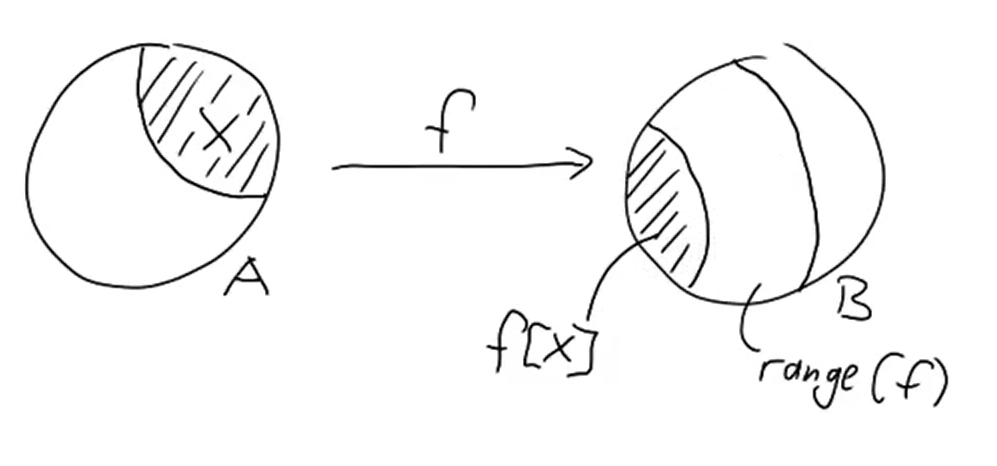
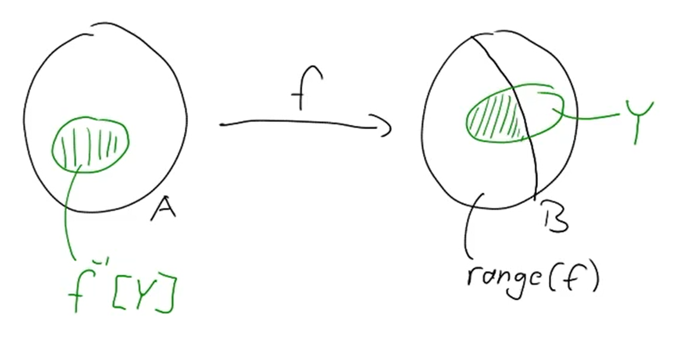

# 集合论基础：函数

14/11/2021
<a style="text-decoration:none; color: black;" href="https://github.com/KevinZonda">KevinZonda</a>

## Basic

### 来着离散数学的定义

函数是一种特殊的二元关系。

**定义：** 设 $F$ 为二元关系，若 $\forall x \in \text{dom}F$ 都存在唯一的 $y \in \text{ran}F$ 使 $xFy$ 成立，则称 $F$ 为 **函数（function，亦或是映射，mapping）**，对于函数 $F$，如果有 $xFy$，则记作 $y = F(x)$，并称 $y$ 为 $F$ 在 $x$ 的值。

**定义：** 设 F, G为函数，则
$$
F=G\Leftrightarrow F \subseteq G \wedge G \subseteq F
$$

**定义：** 设 $A$, $B$ 为集合，如果 $f$ 为函数， 且 $\text{dom}f = A$， $\text{ran}f\subseteq B$ 则 $f$ 称做**从 $A$ 到 $B$ 的函数**，记作  $f: A \to B$ 

**定义：** 设函数 $f: A\to B, A_1 \subseteq A, B_1 \subseteq B$
1. 令 $f(A_1)=\left\{ f(x) \mid x \in A_1\right\}$，称 $f(A_1)$ 为 $A_1$ 在 $f$ 下的**像（image）**，特别地，当 $A_1=A$ 时称 $f(A)$ 为**函数的像**。
2. 令 $f^-{1}(B_1) = \left\{ x \mid x \in A \wedge f(x) \in B\right\}$，称 $f^-{1}(B_1)$ 为 $B_1$ 在 $f$ 下的**完全原像（complete inverse image/preimage ）**

**定义：** 设 $f: A \to B$
- 若 $\text{ran}f=B$，则称 $f: A \to B$ 是 **满射（surjection）** 的
- 若 $\forall y \in \text{ran}f$ 都存在唯一的 $x \in A$ 使得$f(x)=y$，则称 $f: A \to B$ 是 **单射（injection）** 的
- 若 $f: A \to B$ 既是满射又是单射的，则称 $A \to B$ 是**双射（bijection）**的（或**一一映像**）

|  |  |  |  |
| :--: | :--: | :--: | :--: |
| 双射 | 单射但不满射 | 满射但不单射 | 不单射不满射 |

### 来自老师的定理

$$
R \subseteq A \times B, R\text{ is a function from }A\text{ to }B\text{}
$$
if
- Definedness: $\forall a \in A \exists b \in B . (a, b) \in R$
- Single Valuedness: $\forall a \in  \forall b, b' \in B . (a, b) \in R \wedge (a, b') \in R \Rightarrow b = b'$

对于 Definedness来说，其含义在于指示出函数是一种特殊的二元关系。  
对于 Signle Valuedness 来说，其含义指示出一个函数只能指向一个值，而不能指向一群值，即，关系可以为一对一（1:1） 亦或是多对一（m:1）而不可以是一对多（1:m）或多对多（m:m）。

## Features/性质

### Injectivity/Reversibility/单射

$$
\forall a, a' \in A. a\neq a' \Longrightarrow f(a) \neq f(a')\\
f(a)=f(a')\Longrightarrow a=a'
$$

Example: Compression routines(functions)
- Lossless: zip, unzip
- Lossy: mp3, jpeg

**Theorem:** $|A|\leq |B|$ and $|B|\leq |A|$ then $|A| = |B|$  
For any 2 sets A, B we have $|A|\leq |B|$ or $|B|\leq |A|$

### Surjectivity/满射

$$
f: A \to B \text{ is surjective if } \text{range}(f)=B\\
\forall b \in B \exist a \in A. f(a)=b
$$

**Example:** Hash Function

**Theorem:** $|A| \leq |B|$ iff there is a surjective function from $B$ to $A$ ($A \neq \emptyset$)

### Bijectivity/双射

**Theorem:** $|A| = |B|$ iff there is a bijection from $A$ to $B$.

## Image/像

### Forward Image

$$
f:A\to B\\
x\subseteq A\\
f[x]\stackrel{\text{def}}{=}\left\{b \in B\mid \exists a \in X. f(a) = b \right\}
$$

### Backward Image

$$
f:A\to B\\
Y\subseteq B\\

f^{-1}[Y]\stackrel{\text{def}}{=}\left\{a \in A\mid f(a) \in Y \right\}
$$

Example:
$$
f: A \to B\Rightarrow X \subseteq f^{-1}[f[x]]
$$

Proof. Take $a \in X$. Since $f$ is everywhere defined, we get an element $f(a)\in f[x]\subseteq B$.

$$
f^{-1}[f[x]]=\left\{  x\in A \mid f(x)\in f[X]\right\}
$$

We find that $a \in \left\{  x\in A \mid f(x)\in f[X]\right\}$

Q.E.D.

$f$ injective: $|f^{-1}[\left\{b\right\}]|\leq 1$  
$f$ bijective: $|f^{-1}[\left\{b\right\}]|= 1$

## Composing/复合

$$
f: A \to B\qquad
g: B \to C\\
(g \circ f)(a)\Longleftrightarrow g(f(a))
$$

## Counting/计数

对于集合 $A$, $B$，存在 $|A|=n, |B|=m$

对于函数：存在 $m^n$ 种可能性。

对于单射函数：存在 $m\times (m-1) \times (m-2) \times \cdots \times (m-(n-1))=\cfrac{m!}{(m-n)!}$ 种可能性。

对于双射函数：存在 $m\times (m-1) \times (m-2) \times \cdots \times 1=m!$ 种可能性。

如果 $A$ 是一个无限集合（infinite set），并且 $|B|\geq 2$，则存在不可数（uncountablely）个从 $A$ 到 $B$ 的函数。
