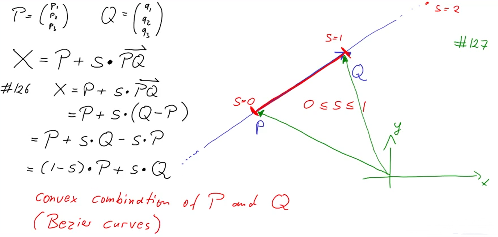
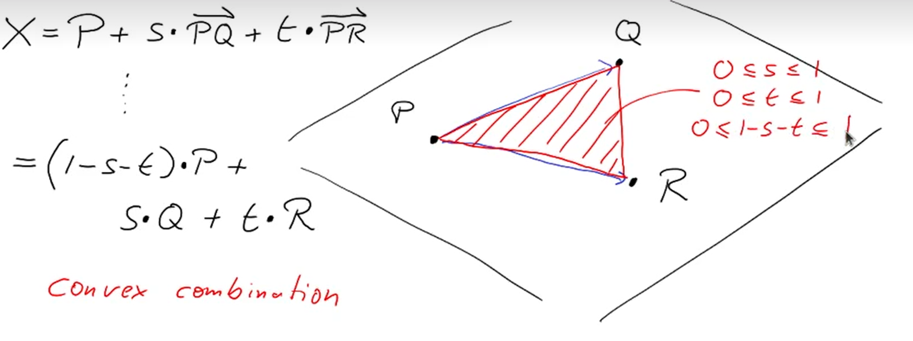
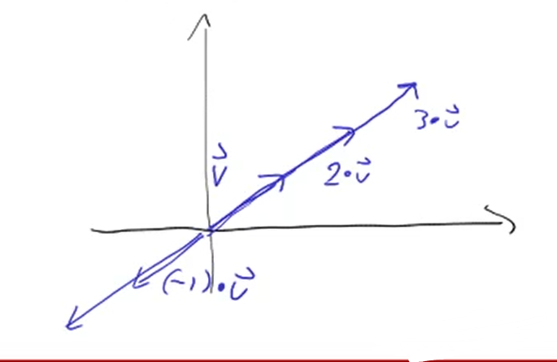

# Linear Algebra: Analytic Geometry/线性代数：解析几何

03/12/2021
<a style="text-decoration:none; color: black;" href="https://github.com/KevinZonda">KevinZonda</a>

## Cartesia Coordinate System/笛卡尔坐标系

通常使用一个对（pair）表示一个坐标。在我们大学，使用竖着的：

$$
\left(\begin{matrix}x\\y\\\end{matrix}\right)
$$

plane: 平面

## Vector/向量

$$
\vec{v}=\left(\begin{matrix}x\\y\\\end{matrix}\right)
$$

$$
|\vec{v}|=\sqrt{v_1^2 + v_2^2}
$$

$$
\vec{0}=\left(\begin{matrix}0\\0\\\end{matrix}\right) \text{ null vector}
$$

$$
P'=P+\vec{v}=\left(\begin{matrix}
p_1 + v_1\\
p_2+v_2\\
\end{matrix}\right)
$$

$$
\overrightarrow{PQ}=\left(\begin{matrix}
q_1-p_1\\
q_2-p_2\\
\end{matrix}\right)
$$

$$
\vec{v}+\vec{w}=\left(\begin{matrix}
v_1+w_1\\
v_2+w_2\\
\end{matrix}\right)
$$

### Scaling

$$
\frac{1}{2}\cdot\vec{v}
$$

### Rules

$\vec{v}+\vec{0}=\vec{v}$

$1\cdot\vec{v}=\vec{v}$

$0\cdot\vec{v}=\vec{0}$

$s\cdot\vec{0}=\vec{0}$

| |
| -- |
| $(s+t)\cdot\vec{v}=s\cdot\vec{v}+t\cdot\vec{v}$ |
| $s\cdot(\vec{v}+\vec{w})=s\cdot\vec{v}+s\cdot\vec{w}$ |
| $(s\times t)\cdot\vec{v}=s\cdot (t \cdot \vec{v})$ |

## Analytic Geometry

### In Plane

$X=P+s\cdot\vec{v}$ parametric representation of a line.

P is a point  
s is a parameter  
v is a vector

如果假设线 X 与 Y 交于一点：

$X=P+s\cdot\vec{v}$  
$Y=Q+t\cdot\vec{w}$  
$X=Y$

$$
P+s\cdot\vec{v}=Q+t\cdot\vec{w}\\

\left(\begin{matrix}
p_1+sv_1\\
p_2+sv_2\\
\end{matrix}\right)=
\left(\begin{matrix}
q_1+tw_1\\
q_2+tw_2\\
\end{matrix}\right)\\
p_1+sv_1=q_1+tw_1\\
p_2+sv_2=q_2+tw_2\\
\Longrightarrow\\
sv_1-tw_1=q_1-p_1\\
sv_2-tw_2=q_2-p_2
$$

## In 3D

$$
\vec{v}=\left(\begin{matrix}
v_1\\
v_2\\
v_3\\
\end{matrix}\right)\\
|\vec{v}|=\sqrt{v_1^2 + v_2^2 + v_3^2}\\
$$

$X=P+s\cdot \vec{v}$ is line in 3D

$X=P+s\cdot \vec{v} + t\cdot\vec{w}$ is plane in 3D

### Example

$$

X=\left(\begin{matrix}
1\\
-2\\
1\\
\end{matrix}\right)+s\cdot
\left(\begin{matrix}
0\\
2\\
1\\
\end{matrix}\right) + t \cdot 
\left(\begin{matrix}
-1\\
1\\
-1\\
\end{matrix}\right)\\

Y=\left(\begin{matrix}
2\\
1\\
0\\
\end{matrix}\right)+r\cdot
\left(\begin{matrix}
1\\
1\\
0\\
\end{matrix}\right) + q \cdot 
\left(\begin{matrix}
0\\
0\\
1\\
\end{matrix}\right)
$$

Let X = Y, will get

$$
1+0\cdot s -t = 2+r+0\cdot q\\
-2+2s+t=1+r+0\cdot q\\
1+s-t=0+0\cdot r + q
$$

Reorganise the equations.

$$
-t-r=1\\
2s+t-r=3\\
s-t-q=-1
$$

by solving it, will get:

$$
q \text{: choose freely}\\
-3r+2q=8\\
r=-2+q/2
$$

So we got

$$
Y=\left(\begin{matrix}
2\\
1\\
0\\
\end{matrix}\right)+(-2+\cfrac{q}{2})\cdot
\left(\begin{matrix}
1\\
1\\
0\\
\end{matrix}\right) + q \cdot 
\left(\begin{matrix}
0\\
0\\
1\\
\end{matrix}\right)\\
=\left(\begin{matrix}
0\\
-1\\
0\\
\end{matrix}\right)+
q \cdot \left(\begin{matrix}
0.5\\
0.5\\
1\\
\end{matrix}\right)\\
=\left(\begin{matrix}
0\\
-1\\
0\\
\end{matrix}\right)+
q \cdot \left(\begin{matrix}
1\\
1\\
2\\
\end{matrix}\right)
$$

### Calc Line By Points

$$
P=\left(\begin{matrix}
p_1\\
p_1\\
p_2\\
\end{matrix}\right), 
Q=\left(\begin{matrix}
q_1\\
q_1\\
q_2\\
\end{matrix}\right)\\
$$

So we can assume the line $X$ is $X=P+s\cdot \overrightarrow{PQ}$

$$
X=P+s\cdot \overrightarrow{PQ}\\
=P+s\cdot{(Q-P)}\\
=P+s\cdot Q - s\cdot P\\
=(1-s)\cdot P+s \cdot Q
$$

Convex combination of P and Q (Bezier Curve).

同样的，对于 3D

$$
X=P+s\cdot \overrightarrow{PQ}+t\cdot \overrightarrow{PR}\\
=(1-s-t)\cdot P + s\cdot Q + t\cdot R
$$

其凸组合：
$$
0\leq s \leq 1\\
0\leq t \leq 1\\
0\leq 1 - s- t \leq 1
$$

## Algebras of Vectors (Vector Spaces)/向量几何（向量空间）

对于向量，依旧可以定义一个类 ring 的代数系统:

$$
\vec{v}+\vec{w}\\
\vec{v}-\vec{w} \stackrel{\text{def}}{=} \vec{v} + (-1)\cdot \vec{w}\\
\vec{0}
$$

我们可以定义向量代数为
- 是一个对象（被称为向量）的集合
- 拥有 =, -, $\vec{0}$, $\cdot$
- Laws are satisfied

我们可以认为向量代数是一些数字的元组（tuples）（$\mathbb{K}$ 的元素）

如果 $V$ 是向量的一个代数，并且 $\vec{v}\in V$

$$
W = \left\{ \vec{w} in V \mid \vec{w} = s \cdot \vec{v} \text{ for some } s\right\}
$$

$W$ 自己就是向量的一给代数
- 自己是向量的集合
- $s\cdot \vec{v}+t\cdot \vec{v}=(s+t)\cdot \vec{v}\in W$
- $\vec{0}=0\cdot \vec{v}\in W$
- $t\cdot(s\cdot\vec{v})=(t\times s)\cdot\vec{v}\in W$

$$
W \subseteq V
$$

$W$ is a subalgebra of $V$

$$
\vec{v},\vec{u}\in V\qquad W=
\left\{
    \vec{w}\in V \mid \vec{w}=s\cdot\vec{v}+t\cdot\vec{u}\text{ for some } s, t
\right\} \subseteq V
$$

**Line:** $X=P+s\cdot \vec{v}$  
$s\cdot \vec{v}$ is element of a subalgebra

**Plane:** $X=P+s\cdot \vec{v}+t\cdot \vec{w}$  
$s\cdot \vec{v}+t\cdot \vec{w}$ is element of a subalgebra  

Affine space? 仿射空间?